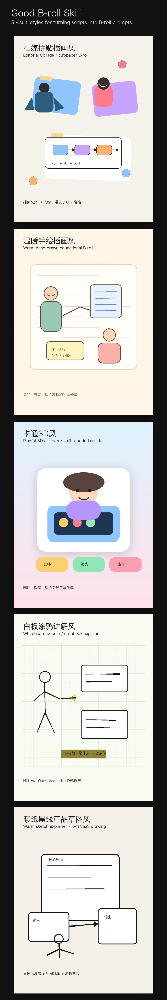

# Good B-roll Skill

Turn short-video scripts, narration, and storyboard notes into usable B-roll image prompts.

This skill helps an AI agent extract the core idea of a script, choose a visual metaphor, select a style, and output image-generation prompts that can be copied into common image models.



## What It Does

- Extracts the key concept, audience, action, and visual metaphor from a script.
- Supports five reusable visual styles:
  - Editorial Collage
  - Warm Hand-drawn Illustration
  - Playful 3D Cartoon
  - Whiteboard Doodle
  - Warm Sketch Explainer
- Produces practical prompts for B-roll, short-video cover images, explainer scenes, and storyboard assets.

## Skill Structure

```text
good-broll/
├── SKILL.md
├── LICENSE
├── README.md
├── assets/
│   └── showcase/
│       ├── editorial-collage.png
│       ├── warm-handdrawn.png
│       ├── playful-3d-cartoon.png
│       ├── whiteboard-doodle.png
│       ├── warm-sketch-explainer.png
│       └── good-broll-showcase.png
├── references/
│   └── style_templates.md
└── scripts/
    └── generate_showcase.py
```

## Example Prompt

```text
帮我给这段视频文案配图：
"以前我做一个工具要写很多代码，现在我可以用 AI 编程工具 10 分钟搭好一个工作流。"
```

The skill will analyze the script and generate B-roll prompt options in the selected style.

## Regenerate Showcase Images

```bash
python3 scripts/generate_showcase.py
```

The showcase images are deterministic local illustrations generated with Pillow. They are meant as open-source visual examples of the five style directions.

## License

MIT
